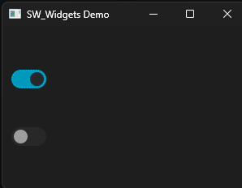
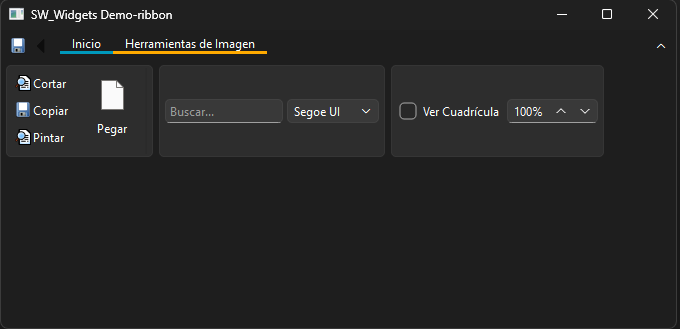

# SW_Widgets

[]()
[]()
[]()

**SW_Widgets** es una librería moderna de widgets personalizados para Qt 6, inspirada en Fluent UI (Windows 11).
Diseñada para ser ligera, reutilizable y totalmente integrada con el sistema de temas (Light / Dark / System).

---

## 🚧 Project Status

Este proyecto está en desarrollo activo.

Actualmente incluye:

* ✔ SWToggleSwitch

Se planea expandir con múltiples widgets modernos como botones, combos avanzados y un sistema tipo Ribbon.

---

## ✨ Features

* 🎛 **SWToggleSwitch** estilo Windows 11
* 🎨 Integración con temas del sistema (QPalette)
* ⚡ Animaciones suaves (QEasingCurve)
* 🖥 DPI-aware
* 🧱 Arquitectura modular (CMake moderno)

---

## 📸 Preview




---

# 🚀 Getting Started

## 🔹 Requisitos

* Qt 6 (Widgets)
* CMake ≥ 3.16
* Compilador C++17
* Ninja o Make (opcional)

---

## 🟢 Opción 1: Qt Creator (RECOMENDADO)

1. Abrir Qt Creator
2. `File → Open File or Project`
3. Seleccionar `CMakeLists.txt`
4. Configurar Kit (Qt 6)
5. Build ▶️
6. Ejecutar `SW_Demo`

---

## 🟢 Opción 2: Consola (Windows + Ninja)

```bash
cmake -G "Ninja" ^
  -DCMAKE_PREFIX_PATH="C:\Qt\6.x.x\mingw_64\lib\cmake" ^
  -DCMAKE_BUILD_TYPE=Release ^
  -DSW_BUILD_EXAMPLES=ON ^
  -S . -B build

cmake --build build
```

Ejecutar demo:

```bash
build\examples\demo_app\SW_Demo.exe
```

---

## 🟢 Opción 3: MSYS2 (MinGW)

Instalar dependencias:

```bash
pacman -S mingw-w64-x86_64-qt6-base mingw-w64-x86_64-cmake mingw-w64-x86_64-ninja
```

Compilar:

```bash
cmake -G "Ninja" \
  -DCMAKE_PREFIX_PATH="/mingw64/lib/cmake" \
  -DSW_BUILD_EXAMPLES=ON \
  -S . -B build

cmake --build build
```

---

## ⚙️ Compilación con Clang (opcional)

### 🟢 Windows (Clang + Ninja)

```bash
cmake -G "Ninja" ^
  -DCMAKE_C_COMPILER=clang ^
  -DCMAKE_CXX_COMPILER=clang++ ^
  -DCMAKE_PREFIX_PATH="C:\Qt\6.x.x\mingw_64\lib\cmake" ^
  -DSW_BUILD_EXAMPLES=ON ^
  -S . -B build-clang

cmake --build build-clang
```

---

### 🟢 MSYS2 (Clang64)

```bash
pacman -S mingw-w64-clang-x86_64-clang mingw-w64-clang-x86_64-qt6-base

cmake -G "Ninja" \
  -DCMAKE_PREFIX_PATH="/clang64/lib/cmake" \
  -DSW_BUILD_EXAMPLES=ON \
  -S . -B build-clang

cmake --build build-clang
```

---

### ⚠️ Nota importante

Usa la versión de Qt correspondiente al compilador:

* MinGW → `mingw_64`
* MSVC → `msvc`
* Clang → `clang64`

---

# 📦 Installation

```bash
cmake --install build --prefix C:/sw_widgets_install
```

---

# 🔗 Usage

```cmake
set(CMAKE_PREFIX_PATH "C:/sw_widgets_install")

find_package(SW_Widgets REQUIRED)

target_link_libraries(MyApp PRIVATE SW::SW_Widgets)
```

---

## 📌 Ejemplo

```cpp
#include <SWFluentUI/SWToggleSwitch.hpp>

auto *toggle = new SWFluentUI::SWToggleSwitch(this);
toggle->setChecked(true);
```

---

# 📁 Project Structure

```
SW_Widgets/
├── include/
├── src/
├── examples/
├── docs/
└── CMakeLists.txt
```

---

# ⚙️ Configuration

| Opción              | Descripción               |
| ------------------- | ------------------------- |
| `SW_BUILD_EXAMPLES` | Compila ejemplos (ON/OFF) |

---

# 🧪 Demo

Ubicado en:

```
examples/demo_app
```

---

# 🛣 Roadmap

* [x] SWToggleSwitch
* [ ] SWButton (Fluent)
* [ ] SWComboBox moderno
* [ ] SWRibbon (tipo Microsoft Office)
* [ ] SWThemeManager global
* [ ] Sistema de animaciones avanzadas

---

# 🤝 Contributing

Pull Requests son bienvenidos.

Pasos:

1. Fork
2. Crear branch (`feature/...`)
3. Commit
4. Pull Request

---

# 📄 License

MIT License

---

# 👨‍💻 Author

Desarrollado como parte del proyecto **SW_Widgets**

---

# ⭐ Notes

* Compatible con Qt 6.x
* Probado en Windows (MinGW)
* Diseñado para integración moderna con CMake
